Проектная работа 

Курс Java Developer. Advanced - Java под нагрузкой

Тема: "Микросервис отчетов использующий Event Sourcing модель реализованный с помощью Spring Framework"

Требования и функционал:

Микросервис состоит из 4 модулей:
1) Модуль Gateway реализованный через внешний rest api и webclient для запросов к остальным модулям
2) Модуль EventSourcing содержащий rest api 
   - для взаимодействия с базой Postgres содержащей события (events)
   - для взаимодействия с базой MongoDB содержащей сформированные документы (проекции событий) 
   - внутренный сервис Kafka для формирования проекций из событий
3) Модуль ReportService реализованный через внешний rest api и подключение к базе MongoDB для формировния pdf отчетов
4) Модуль GRPC-Client/Server - модуль состоящий из 2 подмодулей Client и Server взаимодействующие через протокол gRPC
   Модуль Client имеет rest api для внешнего подключения

Docker файлы выложены в каталог Docker

Микросервис выложен в каталог проект esreportmicroservice

Сборка через maven - clean install

Список api для проверки:

1) WebClient
 http://localhost:8089
 GET :
 /employees/reportemployees - получение pdf файла
 /employees/fileemployees/{fileName} - загрузка csv файла в InMemory репозиторий
 /employees/repositoryEmployee - отправить записи из InMemory в EventSourcing для формирования Id
 /employees/employee - для проверки всего микросервиса - от загрузки файла до получения pdf

 POST :
 /employees/employeees - создание Id в EventSourcing

Пример:
curl --location 'localhost:8089/employees/employeees' \
--header 'Content-Type: application/json' \
--header 'Content-Type: application/json' \
--data-raw '{
    "email": "email@mail.com",
    "address": "Shir 10 1 street",
    "userName": "Samwise Gamgee"
}'

 /employees/employeegrpc

 Пример:
 curl --location 'localhost:8089/employees/employeegrpc' \
--header 'Content-Type: application/json' \
--header 'Content-Type: application/json' \
--data-raw '{
    "id": "10",
    "email": "email@mail.com",
    "address": "Shir 10 1 street",
    "userName": "Samwise Gamgee"
}'

2) EventSourcing 
 http://localhost:8087

 GET :
  /{aggregateId} - получить сформированный document по Id сотрудника

 POST :
  /employee - создать сотрудника

curl --location 'localhost:8087/api/employee' \
--header 'Content-Type: application/json' \
--header 'Content-Type: application/json' \
--data-raw '{
    "email": "email@mail.com",
    "address": "Shir 10 1 ",
    "userName": "Samwise Gamgee"
}'

  /email/{aggregateId} - заменить email сотруднику

curl --location 'localhost:8087/api/email/7ecd8e10-5e6e-41c9-bfa0-20fdfbe2b86a' \
--header 'Content-Type: application/json' \
--header 'Content-Type: application/json' \
--data-raw '{
    "newemail": "emailNew@mail.com"
}'

  /address/{aggregateId} - заменить address сотруднику

  curl --location 'localhost:8087/api/address/e85ac918-d436-400a-89c1-3d164d1b06b6' \
--header 'Content-Type: application/json' \
--header 'Content-Type: application/json' \
--data '{
    "newAddress": "Shir 12 10 str smb i"
}'

3) ReportService
 http://localhost:8097

 GET :
 /employee/records/report - получение pdf отчета

4) GRPC Client
 http://localhost:8098

 POST :
 /api/employee - загрузка клиента из внешней системы

Пример:
curl --location 'localhost:8098/api/employee' \
--header 'Content-Type: application/json' \
--header 'Content-Type: application/json' \
--data '{
    "id": "12",
    "email": "emailcom",
    "address": "Shir",
    "userName": "Samwise Gamgee"
}'

Схема проекта 

Результаты нагрузочного тестирования выполненного с помощью JMeter
(Профилирование проводилось при помощи VisualVM, JDK Mission Control, Memory Analyzer Grafana, Prometheus)

Grafana Dashboards:

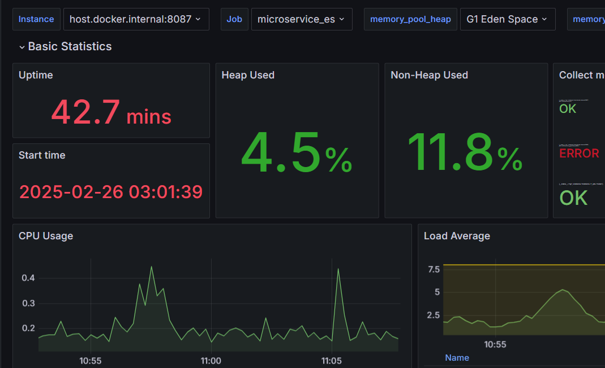

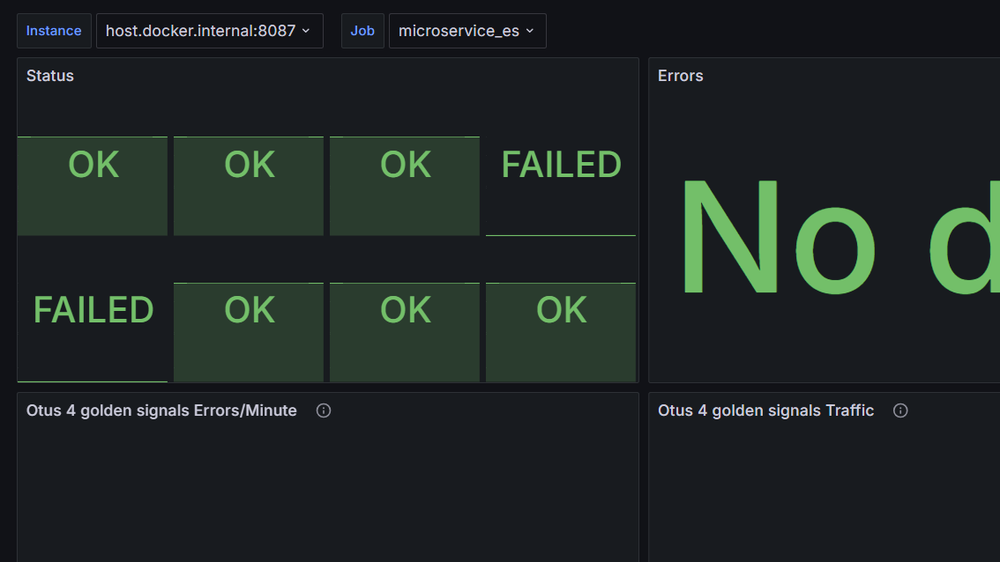

1. Event Source Service

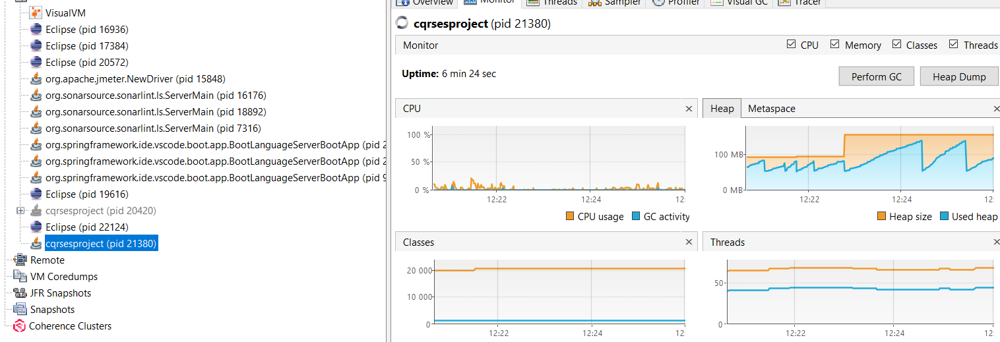

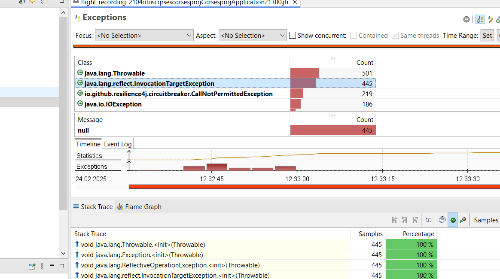

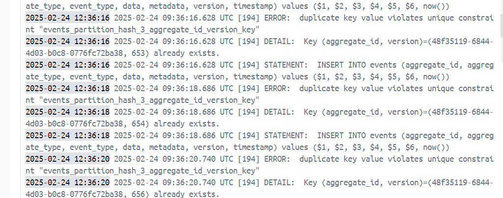

2. GRPC Client Service

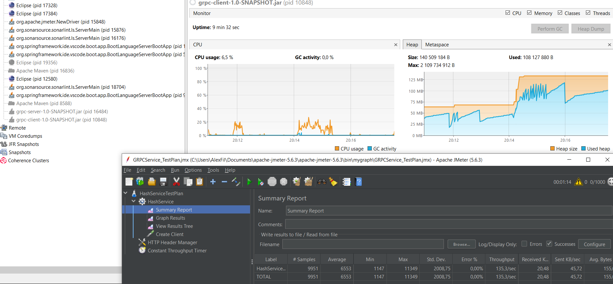

3. Report Service

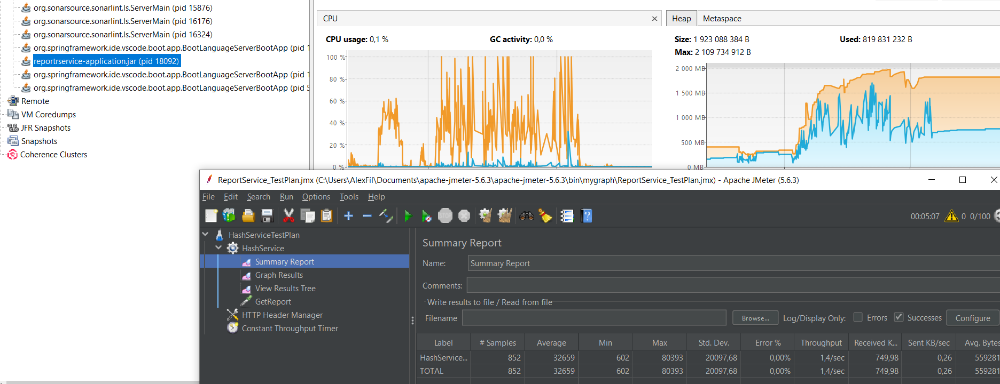

4. WebClient Service

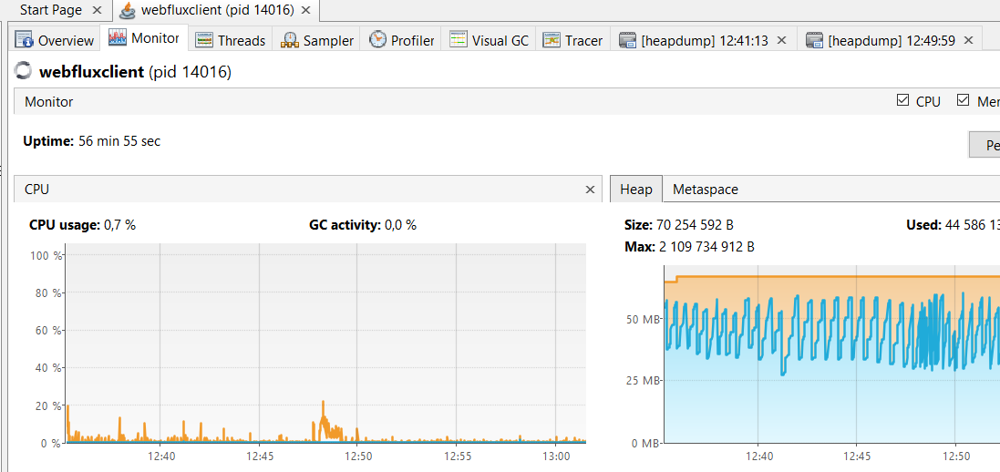

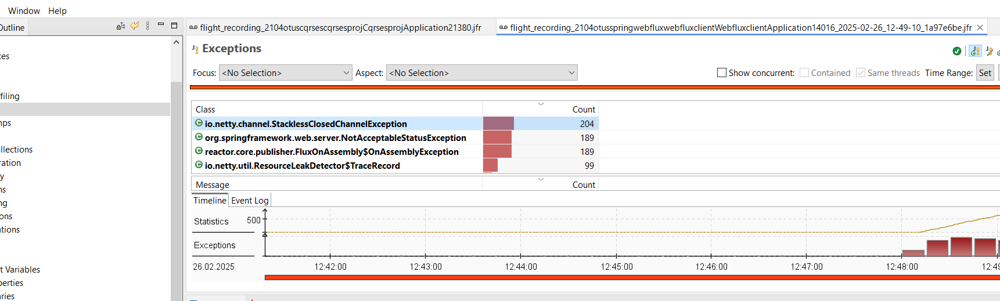

До теста:

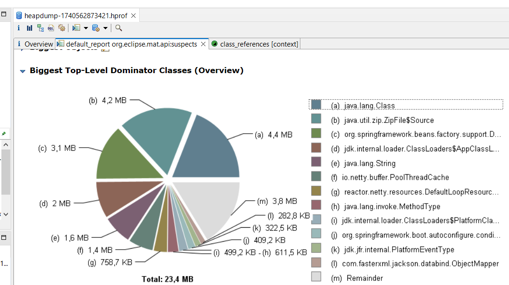

После теста:

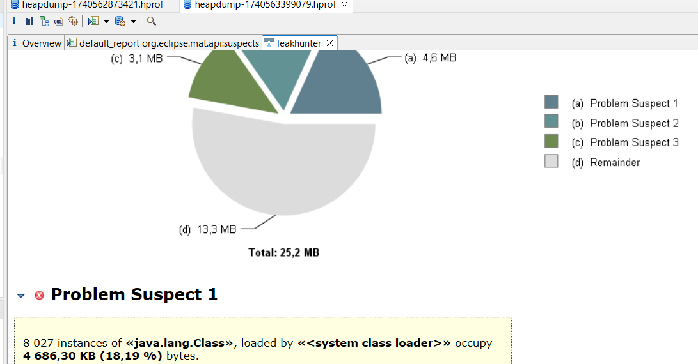